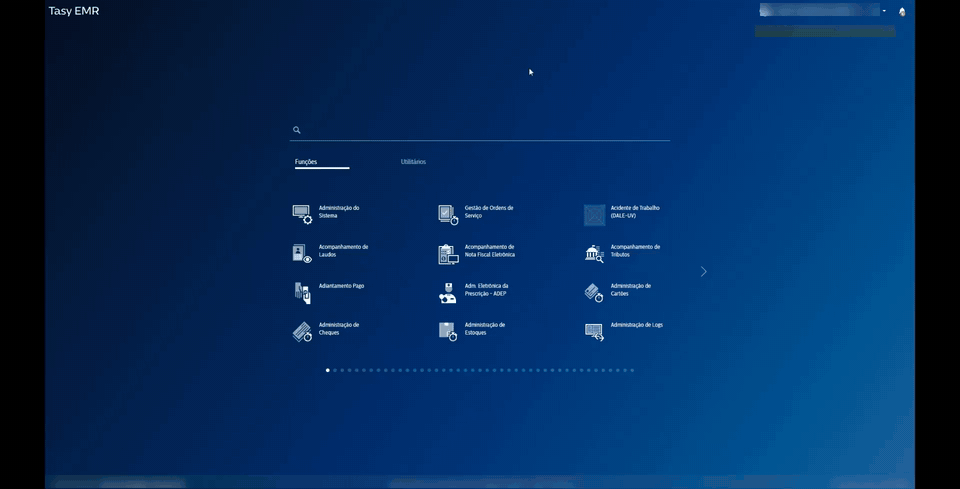
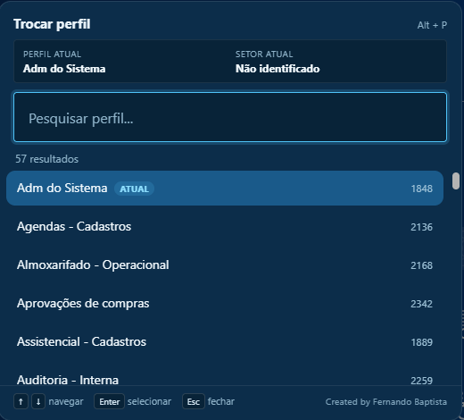
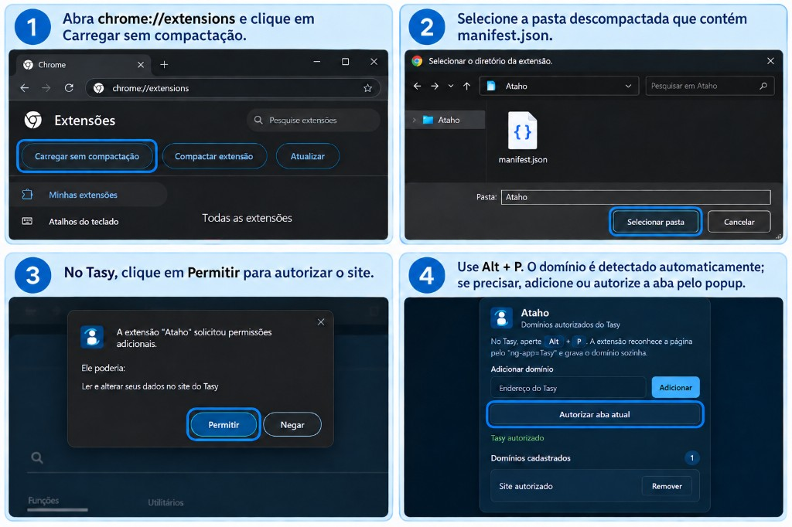

# Ataho

**Atalhos inteligentes para sistemas web.**

Extensão para Chrome. O primeiro módulo é a paleta de perfis no Tasy: pesquise pelo nome, troque na sessão já aberta e, se quiser, reabra a função — somente se o novo perfil tiver acesso.

  

> **Alpha 1.5.24** · Projeto independente. Não é um produto oficial da Bionexo ou do Tasy.

## O que faz

- Pesquisa os perfis da sessão pelo nome (ignora acentos e maiúsculas).
- Abre a paleta com **Alt + P** e troca com teclado ou mouse.
- Pergunta se deseja reabrir a função que estava aberta.
- Só reabre se aquela função estiver liberada no perfil de destino.

## Download e instalação

1. **[Baixe o Tasy-Flow.zip](https://github.com/fernandobaptistaneto/tasy-flow/releases/latest/download/Tasy-Flow.zip)** e extraia em uma pasta permanente.
2. Abra `chrome://extensions` em uma aba do Google Chrome.
3. Ative **Modo do desenvolvedor**.
4. Clique em **Carregar sem compactação** e selecione a pasta `tasy-flow` (a que contém o `manifest.json`).
5. Clique no ícone da extensão e autorize o endereço do seu Tasy.
6. No Tasy, pressione **Alt + P**.

> Se o atalho não funcionar, ajuste em `chrome://extensions/shortcuts`.

## Como usar

1. Com o Tasy aberto, pressione **Alt + P**.
2. Digite parte do nome do perfil.
3. `Enter` para trocar. Se houver função aberta, escolha se deseja reabri-la.

## Privacidade

Tudo roda no navegador, na sessão que você já tem no Tasy. Não há servidor próprio, telemetria, nem coleta de senha, cookie ou token. As permissões de perfil e função continuam sendo as do Tasy.

Este repositório publica o pacote de instalação. O código-fonte **não** é open source.

## Compatibilidade

Chrome e Tasy EMR. Telas e endpoints variam entre ambientes — teste antes de usar em rotina crítica.

## Problemas e sugestões

Abra uma [issue](https://github.com/fernandobaptistaneto/tasy-flow/issues) com a versão do Chrome, a versão do Tasy e o que aconteceu. **Não publique dados de pacientes, credenciais, tokens nem prints com informação sensível.**

---

Created by Fernando Baptista
